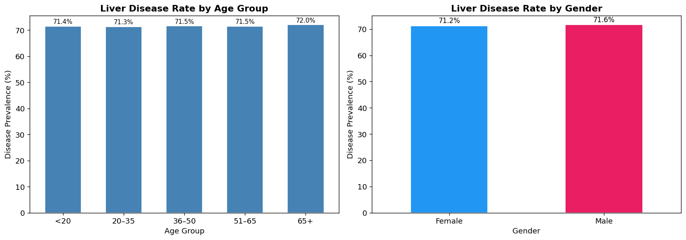
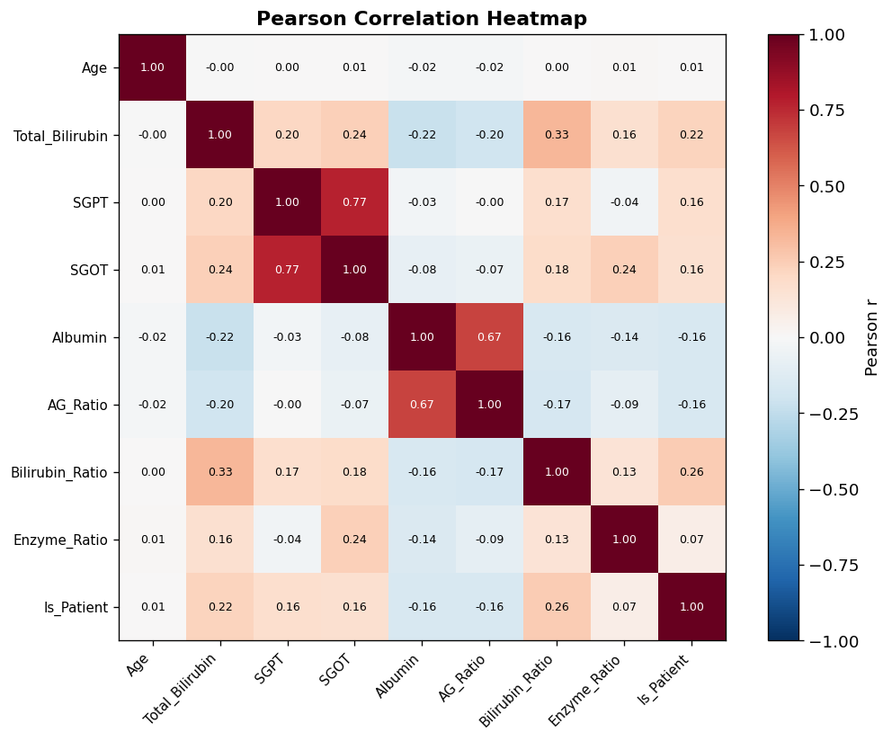
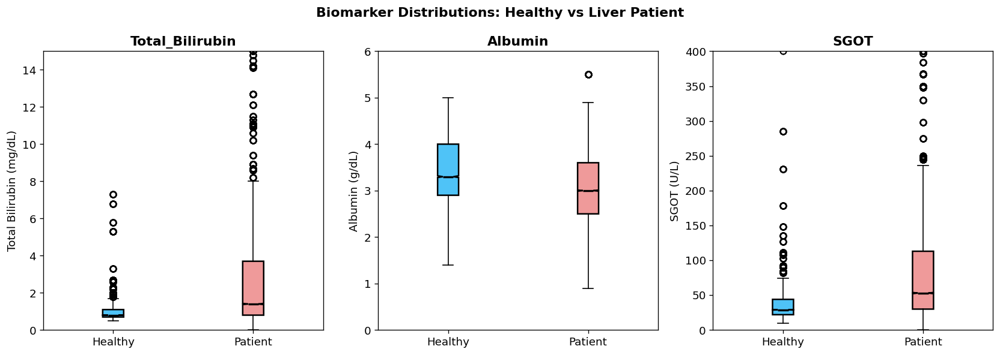
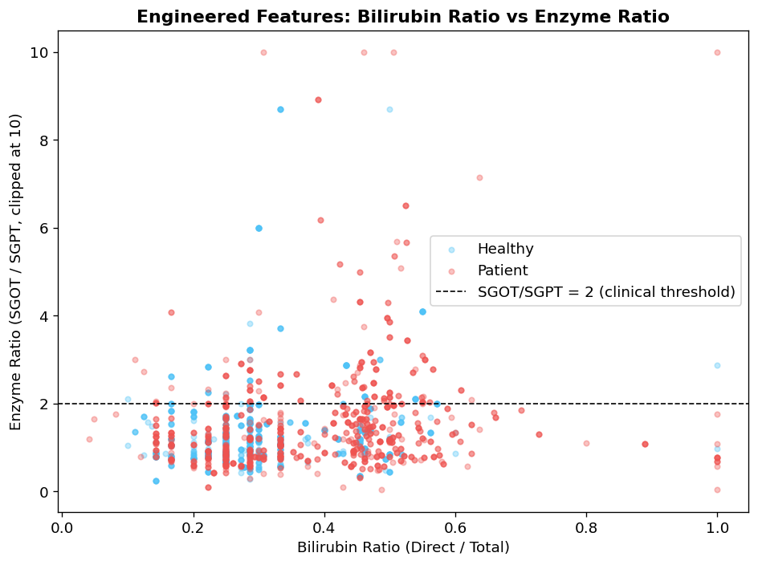

# 🩺 Liver Disease Biomarker Analysis
> *Exploratory Data Science for Clinical Risk Insights*

[](https://python.org)
[](https://jupyter.org)
[](LICENSE)

A statistically-grounded exploratory analysis of liver disease biomarkers to identify high-risk patient subgroups and feature relationships. Built for academic rigor + real-world clinical interpretability.

---

## 🎯 Project Overview
**Problem**: Early detection of liver disease remains challenging due to complex, interacting biomarkers.  
**Goal**: Use exploratory data analysis (EDA) and statistical visualization to:
- Identify biomarker distributions across patient subgroups (gender, disease status)
- Surface correlations between clinical features (ALT, AST, Bilirubin, etc.)
- Engineer interpretable features for potential risk-stratification models
- Communicate findings via clear, publication-ready visualizations

**Domain**: Healthcare / Clinical Data Science  
**Project Type**: Academic Group Project (Final Semester)

---

## 📊 Data
| Source | Description | Records | Features |
|--------|-------------|---------|----------|
| `liver1.csv` | Raw patient biomarker data | ~580 | Age, Gender, TB, DB, Direct_Bilirubin, Alkaline_Phosphotase, SGPT, SGOT, Total_Protiens, Albumin, A/G Ratio, Selector (target) |
| `liver_final.csv` | Cleaned + engineered dataset | ~580 | Original features + derived ratios, normalized scales, missing-value handling |

🔍 *Note: Dataset likely derived from the [Indian Liver Patient Dataset (ILPD)](https://archive.ics.uci.edu/ml/datasets/ILPD).*

---

## 🔬 Methodology
1. **Data Cleaning**: Handle missing values, type conversion, outlier inspection
2. **Subgroup Analysis**: Compare biomarker distributions by gender & disease status
3. **Correlation Analysis**: Heatmaps + statistical significance testing for feature relationships
4. **Feature Engineering**: Create clinically-interpretable ratios (e.g., SGPT/SGOT, Albumin/Globulin)
5. **Visualization**: Publication-ready charts using `matplotlib`/`seaborn`

### 📈 Key Visualizations
| Chart | Insight |
|-------|---------|
|  | Biomarker distributions differ significantly by disease status |
|  | Right-skewed enzyme levels suggest non-normal distribution |
|  | Strong positive correlation between SGPT & SGOT (liver enzyme pair) |
|  | Outlier patterns highlight high-risk patient subgroups |
|  | Derived ratios improve separation between healthy/diseased groups |

---

## 🛠 Tech Stack
```yaml
Core:
  - Python 3.10+
  - Jupyter Notebook
  - pandas, numpy

Visualization:
  - matplotlib, seaborn

Analysis:
  - scipy.stats (for hypothesis testing)
  - scikit-learn (preprocessing, feature engineering)

Reproducibility:
  - requirements.txt
  - Clear notebook cell structure
